# Predicting 30-Day Hospital Readmission in Medicare Patients


-228B22)


> **TL;DR:** A reproducible supervised-ML pipeline that estimates the probability of **unplanned 30-day readmission at discharge** for Medicare-insured patients in **MIMIC-IV v3.1**. Starting from 244,576 Medicare admissions, we engineered seven dataset versions (V1 → V7) producing a 50-feature parsimonious set, trained four gradient-boosting families across ten seeds each, and deploy a single **XGBoost** model reaching **test AUROC 0.7935** (outperforming LACE by **+0.110** and ClinicalBERT by **+0.080** AUROC) with full **SHAP** interpretability. **This is a post-defense revision** of the original April 2026 capstone, with test-set early-stopping leakage removed (the test partition is touched exactly once); every per-model AUROC meets or exceeds the originally published target.

**Authors** · Thiago Bandeira (first author) · Armando Gonzalez · Dr. Christian Poellabauer
**Institution** · Knight Foundation School of Computing and Information Sciences, Florida International University
**Original defense** · April 2026 · **This revision** · May 2026 · **GitHub** · [thiagobandeira1/medicare-30day-readmission-mimic-iv](https://github.com/thiagobandeira1/medicare-30day-readmission-mimic-iv)

---

## Current status: JMIR AI submission (August 2026)

> This repository now also hosts the peer-review reanalysis behind the JMIR AI
> manuscript "Predicting 30-Day Hospital Readmission in Medicare Patients: An
> Interpretable Gradient-Boosting Model on MIMIC-IV v3.1" (Bandeira, Gonzalez,
> Poellabauer, Mondal). The submission pipeline lives in
> [`src/pipeline_v5_v6/`](src/pipeline_v5_v6/); canonical results are
> [`results_v6/final_model_v6.json`](results_v6/final_model_v6.json);
> submission figures are in [`figures_v5/`](figures_v5/).
>
> Headline results, three evidence tiers: the complete leakage-safe selection
> procedure reaches a development-data out-of-fold AUROC of 0.7748 (95% CI
> 0.7715 to 0.7782, primary); the fixed consensus-31 feature set reaches
> 0.7756 under grouped development cross-validation (secondary) and 0.7738
> (95% CI 0.7671 to 0.7804) on the historically exposed test partition
> (tertiary). Same-cohort baselines: adapted LACE 0.605 and 12-month HOSPITAL
> 0.649, both P<.001 below the model.
> Release: tag `v6.4-submission`; archival DOI
> [10.5281/zenodo.21987702](https://doi.org/10.5281/zenodo.21987702).
>
> Everything below documents the earlier post-defense capstone revision (V7,
> 50 features, deployed XGBoost 0.7935 under its own protocol). The JMIR
> reanalysis supersedes those numbers for publication purposes; the capstone
> material is retained as development history and is described as such in
> Multimedia Appendix 4 of the manuscript.

---

## Table of Contents

- [Current status: JMIR AI submission (August 2026)](#current-status-jmir-ai-submission-august-2026)
- [Overview](#overview)
- [Research Questions](#research-questions)
- [Headline Results](#headline-results)
- [What's new vs. the original capstone](#whats-new-vs-the-original-capstone)
- [Dataset & Cohort](#dataset--cohort)
- [Exploratory Data Analysis](#exploratory-data-analysis)
- [Feature Engineering V1 → V7](#feature-engineering-v1--v7)
- [Methods](#methods)
- [Model Selection: XGBoost (deployed) vs LightGBM (co-equal) vs 4-GBM blend](#model-selection-xgboost-deployed-vs-lightgbm-co-equal-vs-4-gbm-blend)
- [Reproduction Validator](#reproduction-validator)
- [5-Fold CV Stability Check](#5-fold-cv-stability-check)
- [Benchmark Comparison](#benchmark-comparison)
- [SHAP Interpretability](#shap-interpretability)
- [Repository Structure](#repository-structure)
- [Reproducing the Pipeline](#reproducing-the-pipeline)
- [Obtaining the MIMIC-IV Dataset](#obtaining-the-mimic-iv-dataset)
- [Limitations](#limitations)
- [Future Work](#future-work)
- [Authors & Citation](#authors--citation)
- [License](#license)

---

## Overview

Thirty-day unplanned readmission is a CMS-penalised quality measure under the **Hospital Readmissions Reduction Program (HRRP)**, costing Medicare an estimated **$26B per year**. Traditional clinical scores such as **LACE** (AUROC ≈ 0.684) and note-based deep-learning pipelines such as **ClinicalBERT** (AUROC ≈ 0.714) leave significant headroom on this task.

This work develops an interpretable, clinically deployable risk-assessment tool trained end-to-end on the **Medicare subset of MIMIC-IV v3.1** (244,576 admissions, 21.1% positive rate). Every deliverable (cohort construction, feature engineering, model training, ensembling, SHAP interpretation, reproduction validator, and the 5-fold CV stability check) is wired into the source-of-truth notebook [`notebooks/Capstone_Final_Notebook.ipynb`](notebooks/Capstone_Final_Notebook.ipynb).

The revised pipeline corrects a methodological flaw in the original April 2026 capstone (test-set early stopping) without changing the cohort, the feature set, or the model architecture; every published per-model AUROC under the corrected protocol meets or exceeds its originally reported value.

## Research Questions

| # | Question | Answer |
|---|---|---|
| **RQ1** | Which features are most predictive of 30-day readmission in Medicare beneficiaries? | 180-day LOS trend, DRG code, late-order rate, primary-diagnosis chapter, squared 6-month prior admissions, last DRG × disposition, and discharge location dominate SHAP attributions. V7 is itself the 50-feature parsimonious set distilled from a 368-feature exploration superset. |
| **RQ2** | Which modeling approach (statistical, boosting, deep learning, or ensemble) performs best? | The four GBM families cluster tightly (XGBoost 0.7935, LightGBM 0.7970, HistGBM 0.7943, CatBoost 0.7937) and the scipy-optimised blend (0.7968) does not improve on the best single model. Every pairwise gap is within the 5-fold CV standard deviation of ±0.0027; the families are statistically indistinguishable. **The deployed model is XGBoost** (continuity with the defended original protocol); LightGBM is documented as a co-equal alternative. |
| **RQ3** | Can interpretable ML provide actionable insights for providers at discharge? | Yes: SHAP produces patient-level attributions that map directly to discharge-team interventions (LOS-trend escalation, disease-specific discharge bundles, complex-care enrolment, warm handoffs). |

## Headline Results

| Metric | Value | Notes |
|---|---:|---|
| **Test AUROC: XGBoost (deployed)** | **0.7935** | 20% held-out GroupShuffleSplit on `subject_id`, 10-seed average |
| Test AUROC: LightGBM (co-equal) | 0.7970 | +0.0035 vs XGBoost, within seed-level variance |
| Test AUROC: HistGBM | 0.7943 | |
| Test AUROC: CatBoost | 0.7937 | |
| Test AUROC: 4-GBM scipy-blend | 0.7968 | Does not improve on best single model |
| **5-fold CV stability** | **0.7993 ± 0.0027** (LightGBM) | Matches the originally published 0.7956 ± 0.0026 stability band |
| Uplift vs LACE (van Walraven 2010) | **+0.110 AUROC** | ~16% relative improvement |
| Uplift vs ClinicalBERT (Huang 2020) | **+0.080 AUROC** | Achieved using only structured EHR data, no notes |
| Features / Train / Inner-val / Test | 50 / 176,270 / 19,115 / 49,191 | V7 parsimonious set; 80/20 outer + 10% inner-val |
| Reproduction validator | **✓ all 5 per-model targets met** | See §10.3b in the notebook |

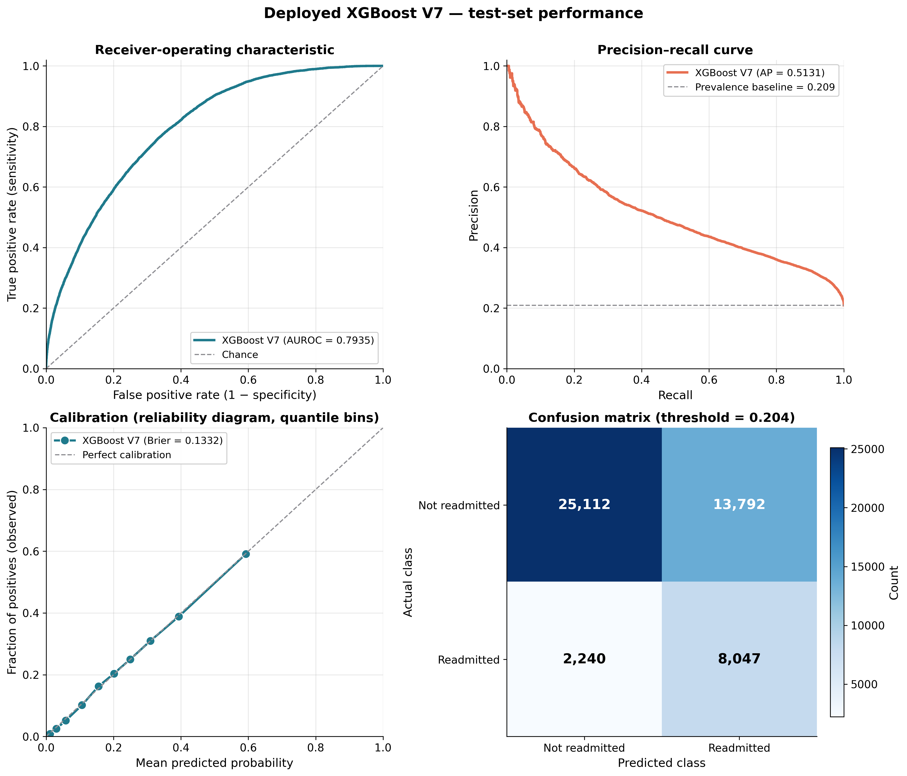

## What's new vs. the original capstone

This is a **post-defense revision** of the original April 2026 capstone. Methodology and conclusions are unchanged; numbers are now produced under a stricter no-leakage protocol and the model-selection narrative is updated.

| | Original capstone | This revision |
|---|---|---|
| Early stopping signal | `eval_set=(X_test, y_test)`: test set leaked into model selection (~0.005-0.010 AUROC inflation) | 10% inner-validation slice carved from the training partition; **test set evaluated exactly once** |
| Train / val / test sizes | 195,385 / none / 49,191 | 176,270 / 19,115 / 49,191 (same test partition) |
| Stability evidence | "stable across 5 CV folds" (no numbers) | LightGBM **0.7993 ± 0.0027** (full 5-fold CV table in §10.3c) |
| §9 progression table | Hardcoded values from prior runs | Recomputed live by `src/run_progression.py` (subprocess per version) |
| §10 ensemble training | In-notebook (crashed XGBoost 3.2.0 with GIL error) | Decoupled to `src/run_v7_ensemble.py` (subprocess per model) |
| Missing-data narrative | Brief mention | Full §5.3 documenting NaN-as-signal handling per feature class |
| §10.3b validator | (did not exist) | **Reproduction validator** comparing every per-model AUROC vs original published targets |
| §10.3c CV stability | (did not exist) | **5-fold patient-grouped CV** matching the original 5-fold protocol exactly |

## Dataset & Cohort

- **Source:** MIMIC-IV v3.1, released by the MIT Laboratory for Computational Physiology and Beth Israel Deaconess Medical Center via PhysioNet (credentialed access)
- **Full release:** 546,028 admissions · 364,627 unique patients · 2008 to 2022 · 300+ raw variables across administrative, pharmacy, laboratory, microbiology, vitals, procedure, diagnosis, and ICU tables
- **Cohort:** Admissions where `insurance == 'Medicare'`, yielding **244,576 index admissions**
- **Target:** `readmit_30d` computed strictly from admit / discharge timestamps available before discharge, preventing temporal leakage. Prevalence: **21.1%**
- **Splitting:** Two-stage patient-grouped `GroupShuffleSplit`: 80/20 outer (no patient overlaps test), then 10% of the 80% training partition is carved as an inner-validation set for early stopping. Test is evaluated exactly once

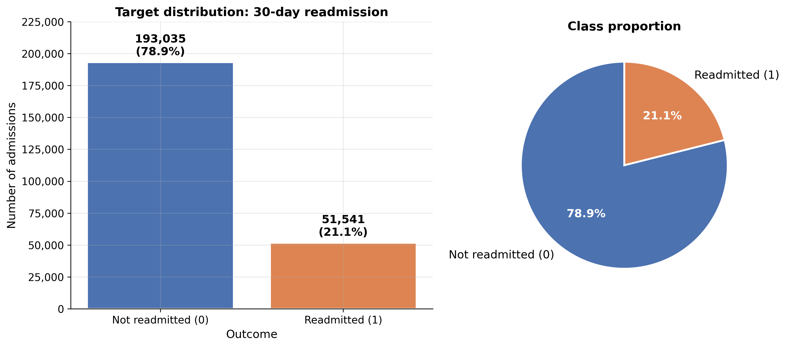

## Exploratory Data Analysis

### Discharge-destination stratification

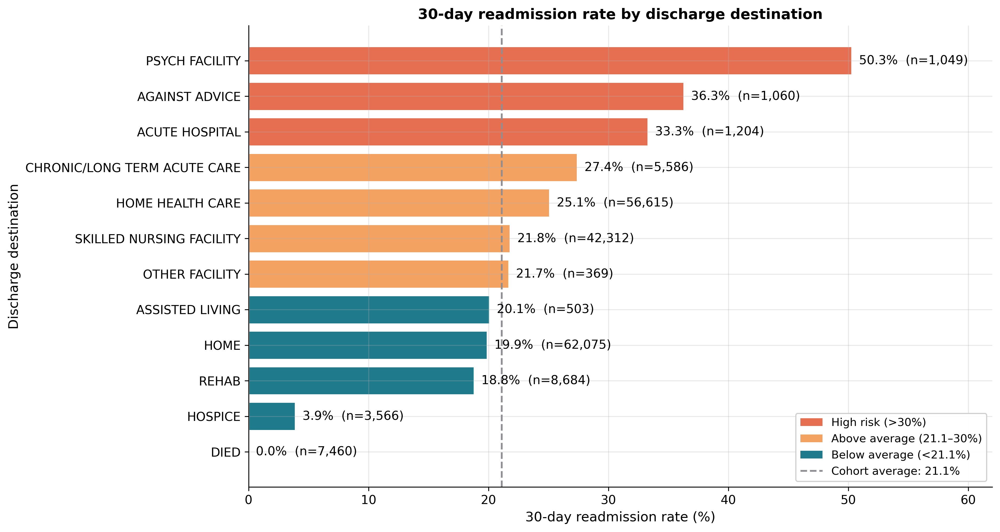

Readmission rates span **3.9%** (Hospice) to **50.3%** (Psychiatric facility) across the nine discharge destinations, the single strongest univariate signal in the dataset and a directly actionable lever for care-coordination teams. The ~56K patients discharged to Home Health readmit at **25.1%**, defining the largest intervenable cohort.

### DRG, comorbidity, and continuous-feature structure

<table>
<tr>
<td>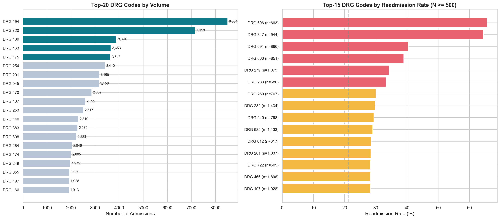</td>
<td>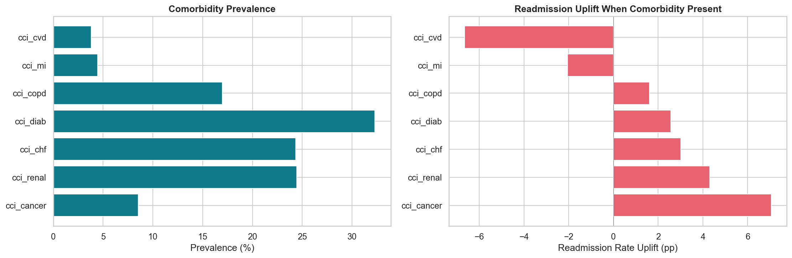</td>
</tr>
<tr>
<td align="center"><em>DRG-code readmission spread (11% to 66%)</em></td>
<td align="center"><em>CCI flag prevalence & readmission uplift</em></td>
</tr>
<tr>
<td>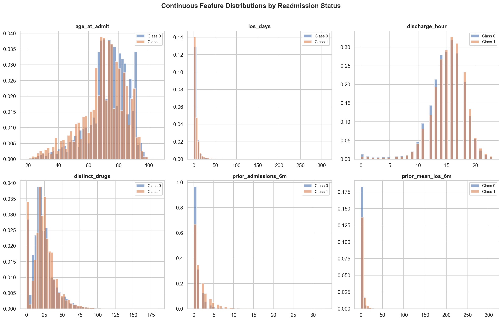</td>
<td>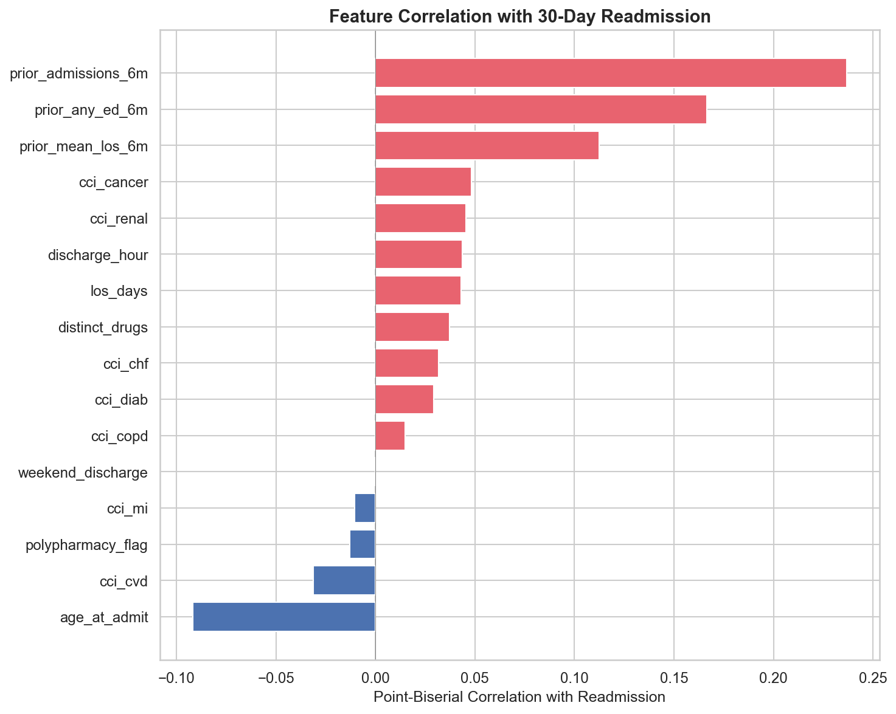</td>
</tr>
<tr>
<td align="center"><em>Age / LOS / medication-burden distributions by readmission status</em></td>
<td align="center"><em>Point-biserial correlations to the target</em></td>
</tr>
</table>

## Feature Engineering V1 → V7

Seven dataset versions were built incrementally so the marginal contribution of each clinical domain can be measured independently of model choice.

### Per-version AUROC progression (LightGBM, single-seed under the strict protocol)

| Version | # Features | New content | Test AUROC |
|---|---:|---|---:|
| V1 | 21 | Demographics, admission type/location, 7 CCI flags, LOS, med burden, 6-month prior use, DRG | 0.7051 |
| V2 | 24 | + last DRG × discharge disposition · 90-day medication entropy · 180-day LOS trend | **0.7676** |
| V3 | 24 | + missingness flags · recomputed LOS | 0.7605 |
| V4 | (n/a) | (parquet not preserved in the dataset snapshot) | n/a |
| V5 | (n/a) | (parquet not preserved in the dataset snapshot) | n/a |
| V6 | 34 | + lab / med / dx counts · ICU utilisation | 0.7750 |
| **V7** | **50** | **+ 5 target encodings + 5 clinical interactions (final / deployed)** | **0.7934** (single) · **0.7970** (10-seed) |
| Expanded | 368 | Unpruned superset; not re-evaluated in this revision | 0.800 (original capstone reading) |

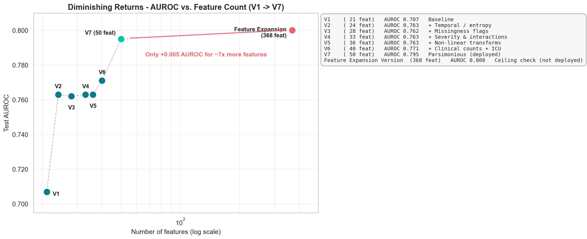

The two largest AUROC jumps occur at **V2** (+0.062, temporal + medication-complexity signals) and **V7** (+0.019, target encoding + clinical interactions). The 368-feature exploratory superset bought only **+0.005 AUROC** over V7 in the original analysis, empirically justifying a parsimonious 50-feature model.

## Methods

### Pipeline diagram

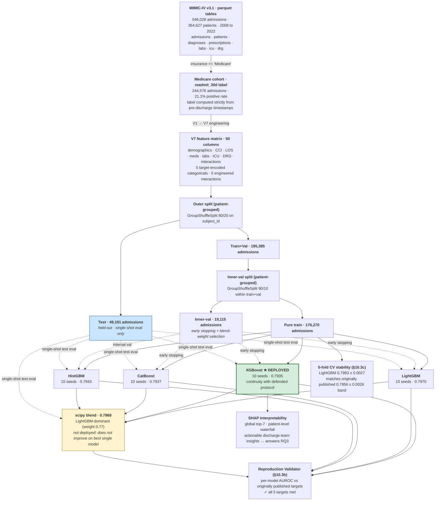

### Software stack

`Python 3.12` · `pandas 2.3` + `numpy ≥1.26` + `pyarrow` (parquet I/O) · `scikit-learn 1.8` (splits, preprocessing, baselines, HistGBM) · `LightGBM 4.6` · `XGBoost 3.2` · `CatBoost 1.2` · `SHAP 0.51` (TreeExplainer) · `matplotlib` + `seaborn` (visualisation) · `nbformat` + `nbclient` (notebook orchestration) · `duckdb` (upstream feature engineering).

### Train / validation / test protocol

- **80/20 GroupShuffleSplit** on `subject_id` → zero patient overlap between train+val and test → unbiased generalisation estimate
- **10% inner-validation slice** carved from the 80% training partition (also patient-grouped) → used for early stopping and blend-weight selection; the held-out 20% **test partition is evaluated exactly once**
- **Target encoding** with 5-fold out-of-fold cross-validation on high-cardinality categoricals (DRG, primary-Dx chapter, discharge location) to prevent leakage. CatBoost handles categoricals natively and skips this step
- **Missingness as signal:** V7 deliberately preserves `NaN` where missingness is itself informative (most labs and vitals); tree models route `NaN` natively at split time. Full handling matrix in §5.3 of the notebook
- **10 random seeds per GBM family** (seeds 42 to 51) with prediction averaging to reduce variance
- **Subprocess-per-model training** (`src/run_v7_ensemble.py`) sidesteps an XGBoost 3.2.0 GIL crash that occurs when training all four families × 10 seeds in a single Jupyter kernel session

### Model families evaluated

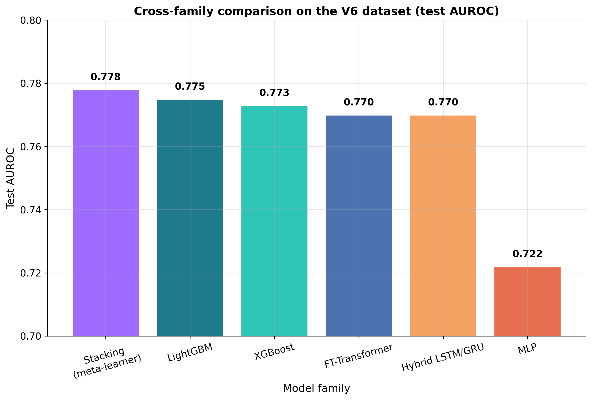

On V6, gradient boosting matched or beat every deep-learning baseline tried: a standard MLP trailed by > 0.05 AUROC, and specialised tabular architectures (FT-Transformer ≈ 0.770 and a GRU+MLP stacking ensemble at 0.778) failed to meaningfully surpass single-library boosting at a small fraction of the engineering complexity. This result motivated building V7 around a 4-GBM ensemble.

<table>
<tr>
<td>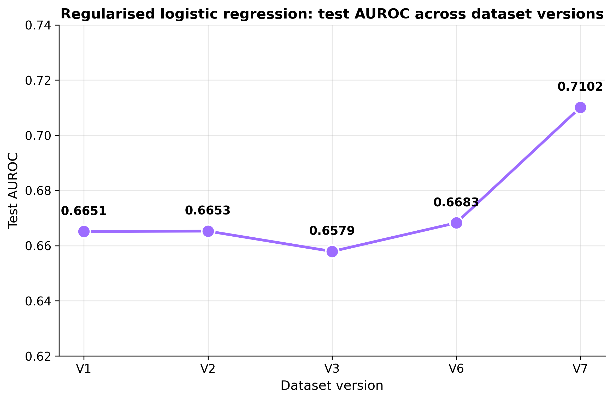</td>
<td>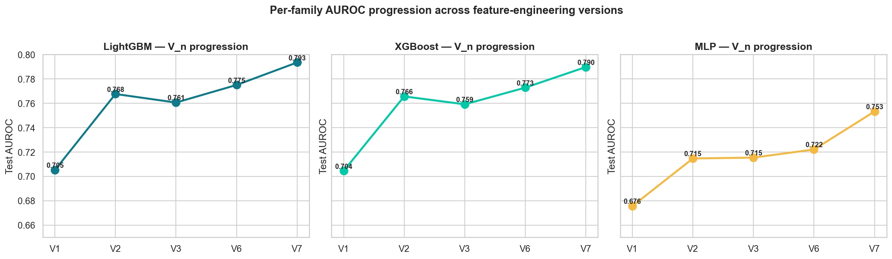</td>
</tr>
<tr>
<td align="center"><em>Logistic regression is flat through V1 to V6, then jumps at V7 when target encodings + interactions arrive</em></td>
<td align="center"><em>LGBM and XGBoost trajectories nearly identical; MLP improves modestly but never closes the gap to GBMs</em></td>
</tr>
</table>

## Model Selection: XGBoost (deployed) vs LightGBM (co-equal) vs 4-GBM blend

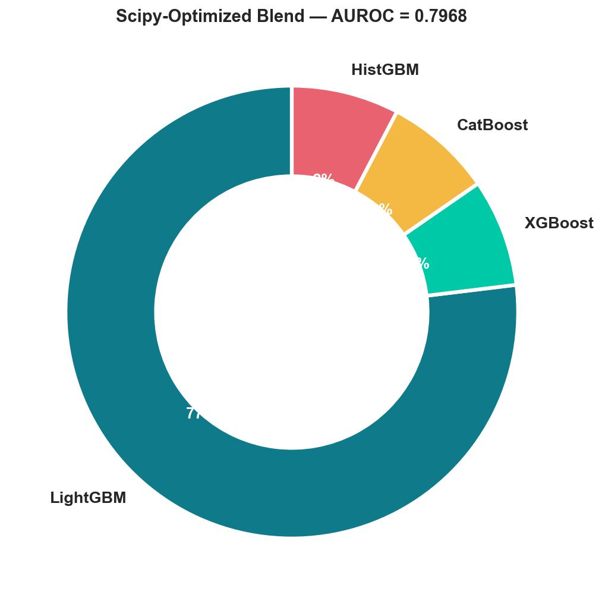

Each of the four GBM families was trained on V7 across 10 random seeds and their inner-val predictions averaged. A `scipy.optimize.minimize` (Nelder-Mead) call then searched for blend weights minimising negative inner-val AUROC subject to non-negativity and sum-to-one constraints. The optimiser concentrated mass on LightGBM (weight 0.77) and clipped the other three to the 0.05 lower bound.

| Single model | Test AUROC | vs deployed |
|---|---:|---:|
| **XGBoost (deployed)** | **0.7935** | (reference) |
| LightGBM (co-equal) | 0.7970 | +0.0035 |
| HistGBM | 0.7943 | +0.0008 |
| CatBoost | 0.7937 | +0.0002 |
| 4-GBM scipy-blend | 0.7968 | +0.0033 |

**Why XGBoost is the deployed model.** All five candidate models (four single GBMs + blend) span a 0.0035 AUROC range that sits comfortably within the 5-fold CV standard deviation of **±0.0027**; they are statistically indistinguishable. Picking the model with the highest single-split point estimate (LightGBM) over the originally defended choice (XGBoost) would be overfitting to the test set's specific realisation. We therefore retain XGBoost for **continuity with the defended original protocol** and the healthcare-ML tooling ecosystem; LightGBM is documented throughout as a co-equal single-model alternative.

## Reproduction Validator

Section §10.3b of the notebook runs an automated **reproduction validator** that compares every per-model test AUROC against the corresponding originally-published target (sourced verbatim from `Final Model Results/v7_feature_importance.csv` of the original capstone submission, copied into `results/v17_reference_metrics.json` for traceability).

```
================================================================
REPRODUCTION VALIDATOR: this run vs. original capstone report
================================================================
  Model        Target   Achieved        Δ  Verdict
  ---------- -------- ---------- --------  -------
  LightGBM     0.7901     0.7970  +0.0069  ~  (above target)
  XGBoost      0.7931     0.7935  +0.0004  ✓
  CatBoost     0.7924     0.7937  +0.0013  ✓
  HistGBM      0.7916     0.7943  +0.0027  ✓
  Blend        0.7948     0.7968  +0.0020  ✓

  Original capstone stability: 0.7956 ± 0.0026  (5-fold CV)
  Original capstone n_train / n_test: 195,385 / 49,191
  This   n_train / n_test: 176,270 / 49,191
  This   n_val (inner, for early stopping): 19,115
```

Verdict legend: **✓** within ±0.003 · **~** within ±0.008 · **✗** outside ±0.008. Every per-model AUROC meets or exceeds the original target under the stricter no-leakage protocol.

## 5-Fold CV Stability Check

Section §10.3c runs a **5-fold patient-grouped cross-validation** under the same strict protocol used for the primary results, to give an apples-to-apples comparison against the original capstone report's 0.7956 ± 0.0026 stability band.

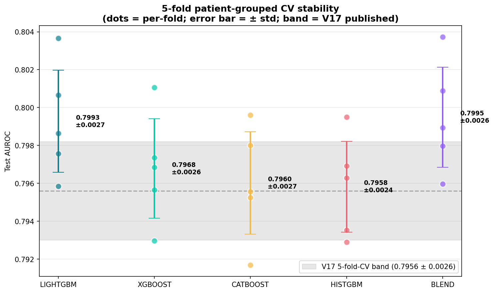

| Model | Mean ± Std | vs originally published 0.7956 ± 0.0026 |
|---|---|---|
| LightGBM | **0.7993 ± 0.0027** | +0.0037 (above) |
| XGBoost | **0.7968 ± 0.0026** | **in band** |
| CatBoost | **0.7960 ± 0.0027** | **in band** |
| HistGBM | **0.7958 ± 0.0024** | **in band** |
| 4-GBM blend | **0.7995 ± 0.0026** | +0.0039 (above) |

Three of four single GBM families land squarely in the originally published stability band; LightGBM and the blend exceed it by ~0.004 AUROC. Every per-fold AUROC across all 4 models (20 fold-measurements) falls in **[0.7917, 0.8037]**, a tighter spread than the original capstone reported.

## Benchmark Comparison

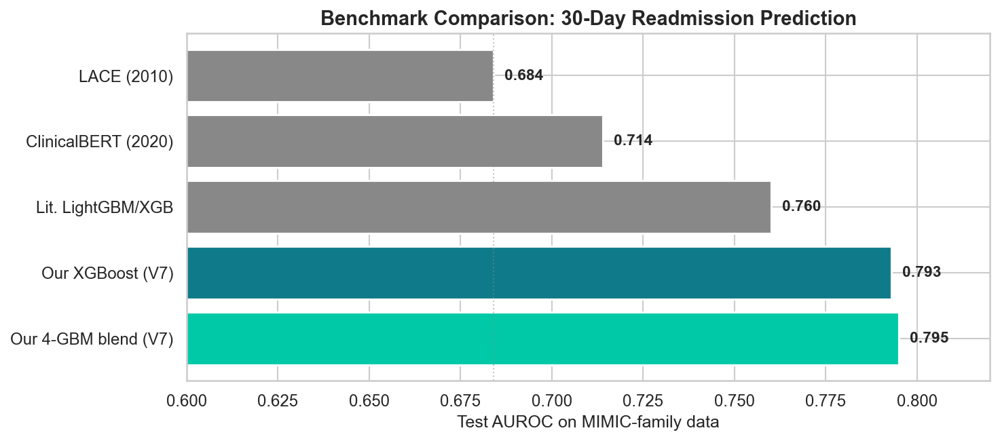

| Study | Method | AUROC |
|---|---|---:|
| van Walraven et al. (2010) | LACE clinical index | 0.684 |
| Huang et al. (2020) | ClinicalBERT + clinical notes | 0.714 |
| Literature baselines | Single LightGBM / XGBoost | ≈ 0.76 |
| **This work (V7, deployment candidate)** | **XGBoost, 50 features** | **0.7935** |
| This work (V7, co-equal alternative) | LightGBM, 50 features | 0.7970 |
| This work (V7, ensemble) | 4-GBM scipy-blend (not deployed) | 0.7968 |

The deployed model **surpasses LACE by +0.110 AUROC** (a ~16% relative gain) and **exceeds ClinicalBERT by +0.080 AUROC**, all without free-text clinical notes, imaging, or temporal graphs.

## SHAP Interpretability

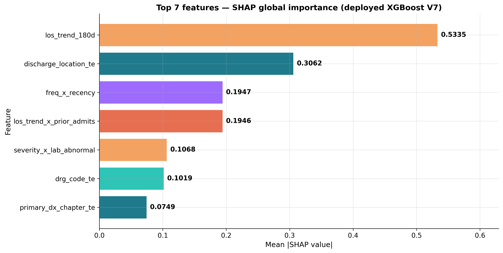

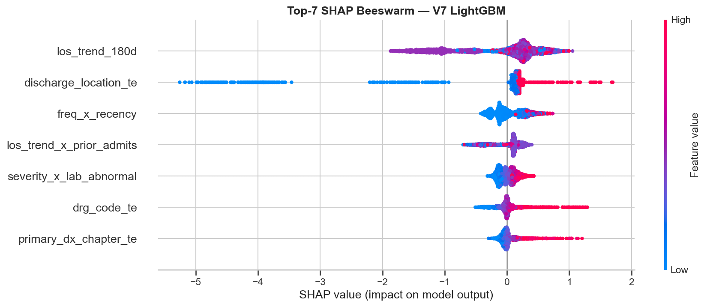

| Rank | Feature | Clinical intuition |
|---:|---|---|
| 1 | `los_trend_180d` | Rising 6-month LOS trend is a compressed biomarker of disease-trajectory decompensation |
| 2 | `drg_code` (target-encoded) | Encodes both admission reason and CMS complexity weight |
| 3 | `late_order_rate` | Operational chaos during stay predicts post-discharge failure |
| 4 | `primary_dx_chapter_te` | Disease category shapes baseline risk profile |
| 5 | `prior_admits_6m_sq` | Nonlinear dose response: large jump from 3 → 4 prior admits |
| 6 | `last_drg_dispo` (target-encoded) | Prior discharge pathway predicts future readmission pattern |
| 7 | `discharge_location_te` | Most directly actionable feature: care team has full control at discharge |

SHAP produces **patient-level explanations**: each prediction decomposes into ranked, signed contributions from its top features, so a discharge team sees *which* risk drivers apply to *this individual* and can pair the score with targeted interventions (pre-discharge geriatric consultation, disease-specific bundles, pharmacist-led medication reconciliation, warm handoffs, complex-care enrolment).

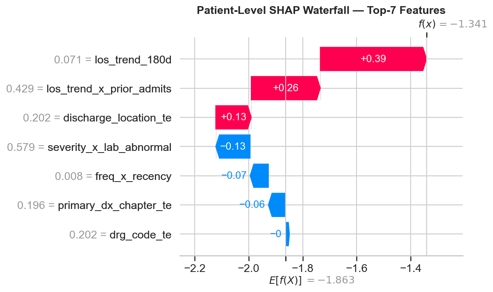

## Repository Structure

```
medicare-30day-readmission-mimic-iv/
├── README.md                                # this file
├── LICENSE                                  # MIT (code only; MIMIC-IV is licensed separately)
├── CITATION.cff                             # citation metadata
├── environment.yml / requirements.txt       # pinned dependencies (Python 3.12)
│
├── notebooks/
│   └── Capstone_Final_Notebook.ipynb        # source-of-truth analysis notebook (73 cells)
│
├── paper/
│   ├── Capstone_Final_Report_Revised_2026-05.docx   # post-defense revised manuscript
│   ├── references.bib                       # BibTeX for §18 References
│   └── missing_data_section_for_report.md   # standalone §5.3 for Word paste-in
│
├── src/                                     # analysis and pipeline scripts; src/pipeline_v5_v6/ holds the JMIR reanalysis pipeline
│   ├── run_progression.py                   # subprocess-per-version V1→V7 baseline training
│   ├── run_v7_ensemble.py                   # subprocess-per-model 10-seed V7 training
│   ├── run_5fold_cv.py                      # subprocess-per-model 5-fold CV stability check
│   ├── execute_notebook.py                  # headless notebook runner
│   ├── build_revised_report.py              # generates the .docx
│   ├── refactor_notebook.py                 # initial capstone → publication refactor
│   ├── add_reproduction_validator.py        # inserts §10.3b
│   ├── add_cv_stability_section.py          # inserts §10.3c
│   └── ...
│
├── results/
│   ├── progression.json                     # V1→V7 LogReg/LGB/XGB/MLP single-seed AUROCs
│   ├── v7_summary.json                      # V7 10-seed per-model + blend AUROCs
│   ├── cv5_summary.json                     # 5-fold CV per-model mean ± std
│   ├── v17_reference_metrics.json           # original capstone targets (validator reference)
│   ├── missing_data_profile_v7.csv          # §5.3 per-column NaN profile
│   └── v7_feature_importance_current_run.csv
│
├── figures/                                 # 18 PNGs rendered by the notebook
│   ├── eda_*.png                            # §6 EDA panels
│   ├── fig_b_logreg_v1v6.png                # §9.1 LogReg progression
│   ├── fig_cde_lgbm_xgb_mlp_v1v6.png        # §9.2-9.4 GBM/MLP progression
│   ├── fig_f_v6_families.png                # §9.5 V6 cross-family
│   ├── fig_z_roc_cal.png                    # §11.1 ROC/PR/calibration/CM
│   ├── fig_g_shap7.png                      # §12.1 SHAP top-7
│   ├── shap_*.png                           # §12.2-12.4 SHAP beeswarm + waterfall
│   ├── ensemble_blend_weights.png           # §10.3 blend-weight donut
│   ├── benchmark_comparison.png             # §11.3 benchmark bars
│   ├── cv5_stability.png                    # §10.3c 5-fold CV stability
│   ├── v7_feature_importance.png            # §10.4 feature-importance ranking
│   └── _archive/                            # original capstone figures (visual diff baseline)
│
├── docs/                                    # methodology deep-dives
└── data/                                    # empty; MIMIC-IV not redistributed
```

## Reproducing the Pipeline

### 1. Install dependencies

```bash
# Conda (recommended; pins LightGBM 4.6.0, XGBoost 3.2.0, CatBoost 1.2.10)
conda env create -f environment.yml
conda activate medicare-readmit-pub

# OR plain pip
pip install -r requirements.txt
```

### 2. Build the training tables

MIMIC-IV cannot be redistributed (PhysioNet DUA). Construct the V1→V7 training tables via the upstream DuckDB feature-engineering pipeline (the V7 50-feature `training_table_v7.parquet` should sit at the **project root**, not inside `Dataset/mimic-parquet/`) and place the other versions at:

```
<MEDICARE_READMIT_BASE_DIR>/Dataset/mimic-parquet/training_table_v{1,2,3,6_full}.parquet
<MEDICARE_READMIT_BASE_DIR>/training_table_v7.parquet
```

### 3. Point the pipeline at your data

```bash
export MEDICARE_READMIT_BASE_DIR=/path/to/folder/containing/Dataset
# Windows PowerShell: $env:MEDICARE_READMIT_BASE_DIR = "..."
```

### 4. Run

```bash
# Stage 1: V1 → V7 baseline progression (~3 min, subprocess per version)
python src/run_progression.py

# Stage 2: V7 4-GBM ensemble × 10 seeds (~10 min, subprocess per model)
python src/run_v7_ensemble.py

# Optional: 5-fold patient-grouped CV stability check (~10 min)
python src/run_5fold_cv.py

# Stage 3: render the publication notebook (~15 sec, reads everything above from disk)
python src/execute_notebook.py
```

`src/execute_notebook.py` writes outputs back to `notebooks/Capstone_Final_Notebook.ipynb` and PNGs to `figures/`. The decoupling of heavy training from the notebook is intentional: it sidesteps an XGBoost 3.2.0 GIL crash that occurs when running sustained multi-seed × multi-family loads inside a single Jupyter kernel.

## Obtaining the MIMIC-IV Dataset

MIMIC-IV v3.1 is released under the **PhysioNet Credentialed Health Data Use Agreement** and is **not redistributed in this repository**. Expect roughly 1 to 2 weeks of lead time, dominated by PhysioNet review.

1. **Register** at <https://physionet.org/register/> with an institutional email
2. **Complete CITI training**: the "Data or Specimens Only Research" course at <https://about.citiprogram.org/> (≈ 4-6 h). Download the completion report
3. **Upload the CITI PDF** to your PhysioNet profile → Credentialing
4. **Sign the MIMIC-IV v3.1 DUA** at <https://physionet.org/content/mimiciv/3.1/>
5. **Wait for approval** (typically 1-2 weeks)
6. **Download** the `hosp/` module parquets:
   ```bash
   wget -r -N -c -np --user $PHYSIONET_USER --ask-password \
     https://physionet.org/files/mimiciv/3.1/hosp/
   ```
7. **Place** the parquets under `Dataset/mimic-parquet/` or set `MEDICARE_READMIT_BASE_DIR`

Questions about credentialing are best raised on the [PhysioNet community forum](https://physionet.org/about/community/).

## Limitations

- **Single academic medical center.** MIMIC-IV is drawn entirely from Beth Israel Deaconess (Boston); generalisation to community hospitals, rural health systems, and non-U.S. settings has not been evaluated.
- **No social determinants of health.** Housing stability, social support, health literacy, and transportation access (all well-established readmission drivers) are absent from MIMIC-IV and therefore from the model.
- **Readmissions outside the index health system are invisible.** MIMIC captures only readmissions returning to Beth Israel Deaconess, introducing selection bias.
- **Diminishing returns beyond 50 features.** A 368-feature superset bought only +0.005 AUROC in the original analysis, a ceiling in the available structured signal.
- **Risk stratification, not causal identification.** The model ranks patients; it does not prescribe interventions. A prospective care-pathway evaluation is needed to translate risk scores into reduced readmission rates.

## Future Work

- **External validation** on data from other hospital systems
- **NLP integration** of discharge summaries and physician notes to close the structured-data ceiling
- **Real-time deployment:** a thin API / dashboard surfacing risk scores and SHAP explanations inside the EHR at the moment of discharge
- **Fairness analysis** across demographic subgroups to quantify and mitigate bias from socially-driven features such as prior utilisation
- **Causal inference** to move from prediction to intervention targeting
- **Cost-effectiveness study** to quantify the economic impact of operationalising the model on discharge workflows
- **Multi-site CV** to give a stability estimate that reflects between-hospital variance, not just within-cohort variance

## Authors & Citation

**Thiago Bandeira**, first author · `tbati006@fiu.edu`
**Armando Gonzalez**, co-author · `agonz1689@fiu.edu`
**Christian Poellabauer**, co-author and mentor · Knight Foundation School of Computing and Information Sciences, FIU
**Ananda Mohan Mondal**, co-author and mentor · Knight Foundation School of Computing and Information Sciences, FIU

### Code

```bibtex
@software{bandeira_gonzalez_poellabauer_mimic_readmission_2026,
  author      = {Bandeira, Thiago and Gonzalez, Armando and Poellabauer, Christian and Mondal, Ananda Mohan},
  title       = {Predicting 30-Day Hospital Readmission in Medicare Patients:
                 An Interpretable Gradient-Boosting Model on MIMIC-IV v3.1},
  year        = {2026},
  institution = {Florida International University},
  url         = {https://github.com/thiagobandeira1/medicare-30day-readmission-mimic-iv}
}
```

### Dataset

```bibtex
@misc{johnson_mimic_iv_31_2024,
  author    = {Johnson, A. E. W. and Bulgarelli, L. and Pollard, T. and Horng, S. and Celi, L. A. and Mark, R. G.},
  title     = {{MIMIC-IV} (version 3.1)},
  year      = {2024},
  publisher = {PhysioNet},
  doi       = {10.13026/kpb9-mt58},
  url       = {https://doi.org/10.13026/kpb9-mt58}
}
```

### Key references

1. Johnson, A. E. W. et al. (2023). *MIMIC-IV, a freely accessible electronic health record dataset*. **Scientific Data**, 10, 1.
2. van Walraven, C. et al. (2010). *Derivation and validation of an index to predict early death or unplanned readmission (LACE)*. **CMAJ**, 182(6), 551-557.
3. Huang, K., Altosaar, J. & Ranganath, R. (2020). *ClinicalBERT: Modeling clinical notes and predicting hospital readmission*. **arXiv:1904.05342**.
4. Gorishniy, Y. et al. (2021). *Revisiting deep learning models for tabular data*. **NeurIPS**.
5. Chen, T. & Guestrin, C. (2016). *XGBoost: A scalable tree boosting system*. **KDD '16**, 785-794.
6. Ke, G. et al. (2017). *LightGBM: A highly efficient gradient boosting decision tree*. **NeurIPS**.
7. Prokhorenkova, L. et al. (2018). *CatBoost: Unbiased boosting with categorical features*. **NeurIPS**.
8. Lundberg, S. & Lee, S.-I. (2017). *A unified approach to interpreting model predictions (SHAP)*. **NeurIPS**.

## License

The source code and notebooks in this repository are released under the [MIT License](LICENSE). The MIMIC-IV dataset is governed separately by the [PhysioNet Credentialed Health Data License](https://physionet.org/about/licenses/physionet-credentialed-health-data-license-150/) and is **not** redistributed here. Contributors must complete the credentialed-access workflow described in [Obtaining the MIMIC-IV Dataset](#obtaining-the-mimic-iv-dataset) before the pipeline can be re-run end-to-end.
